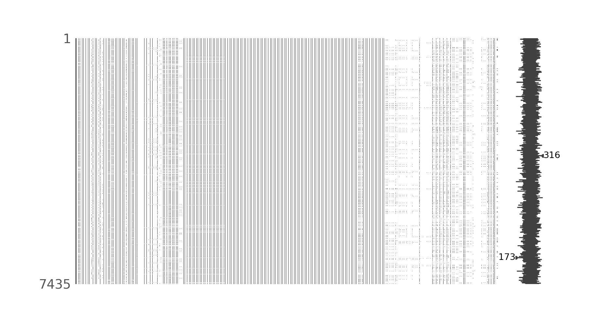
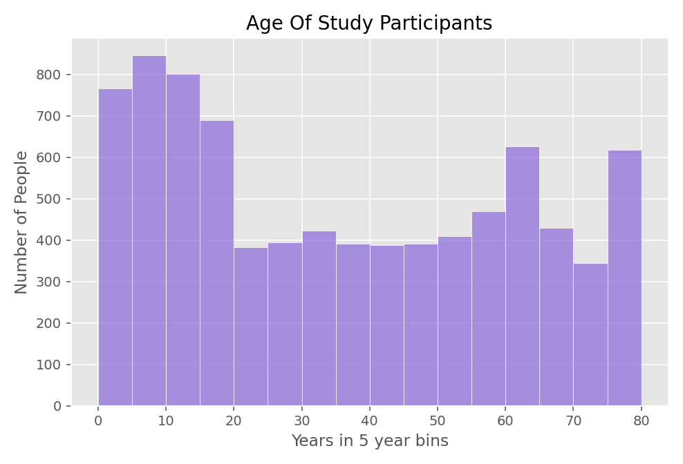
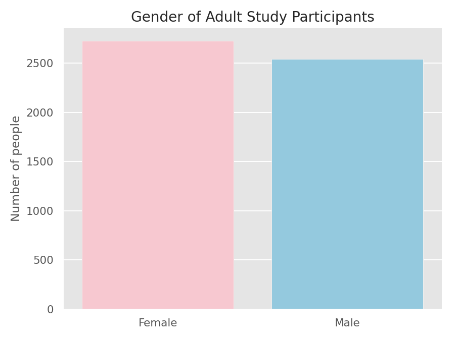
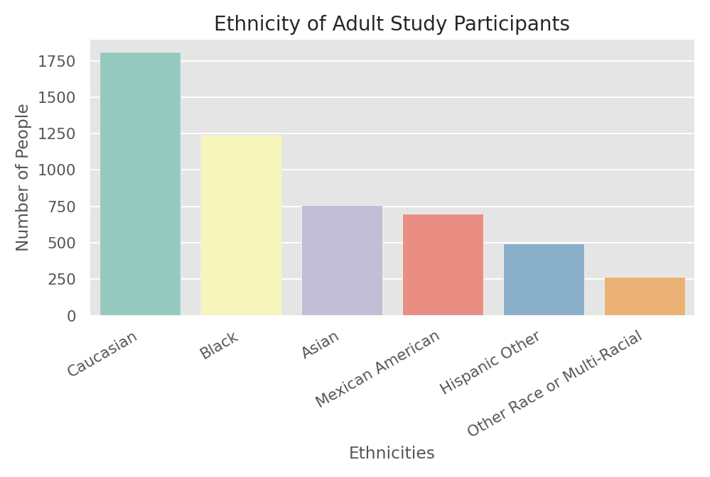
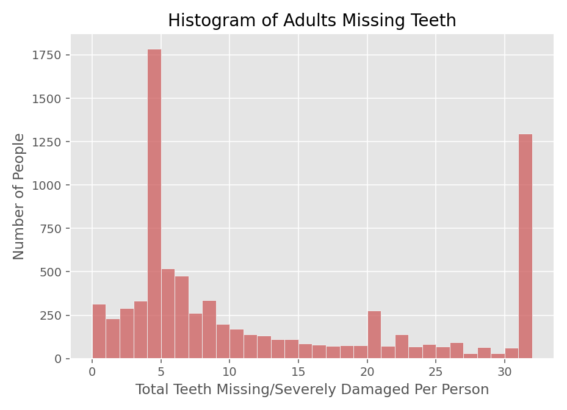
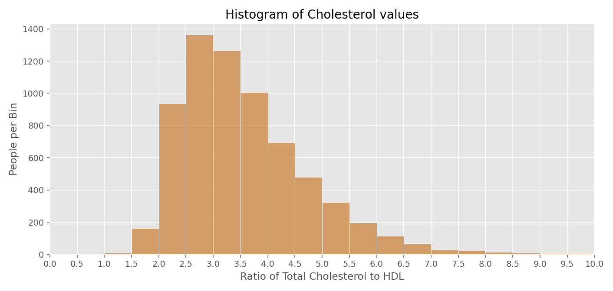
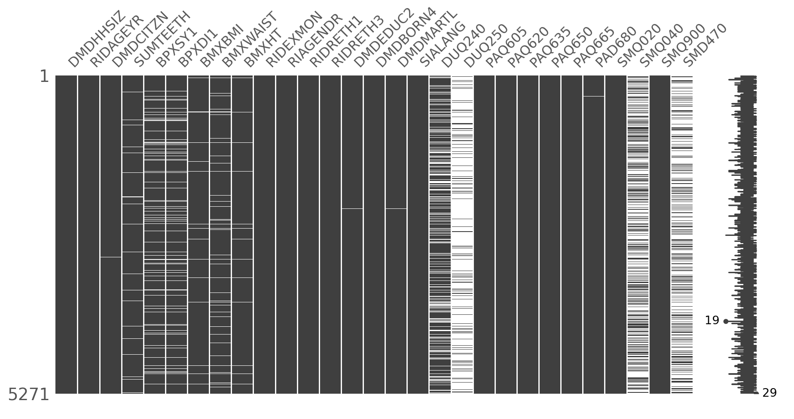
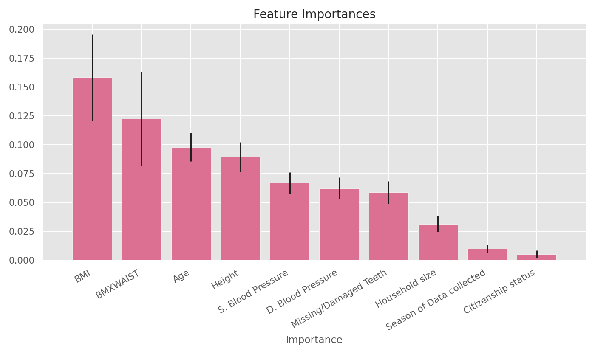

# Predicting Blood Health 
## Table of contents
1. [Background](#Background)
2. [Data Retrieval](#Data-Retrieval)
3. [Data Description](#Data-Description)
4. [Data Cleaning](#Data-Cleaning)
5. [EDA](#EDA)
6. [Model Performance](#Model-Performance)
7. [Conclusion](#Conclusion)

# Goal
The goal of this project was to attempt to predict blood cholesterol levels based on easily obtained measurements and information from the 2017-2018 NHANES data which was recently published. 

# Background 

This is likely possible because of the well studied relationship between exercise, diet and blood-health. This information as well as many other metrics are obtained through the NHANES program. This program travels the country attempting to capture a snapshot of the nations health. Many questionnaires are included as well as DEXA scans, body measurements, and blood tests. The data in NHANES is intended to be very detailed and it therefore is a very good resource for understanding human health. While a large portion of this data is collected at the center there are still many missing data values in the study. This can be for many reasons such as individual constraints or denials. In many situations there is also a language barrier to overcome. 

We will look specifically at the ratio of Total blood cholesterol to HDL cholesterol with this model. The ratio of the two has been shown to be more predictive than looking at one or the other and in conjunction with high sensitivity CRP (another blood marker) these are highly predictive of heart attacks ([N. Rifia P. Ridcker 2001](https://academic.oup.com/clinchem/article/47/3/403/5639279)). Blood health is not always evaluated at regular intervals being able to predict it therefore using easier to obtain data would be highly beneficial to doctors and health insurance companies to see who may need to have their blood examined. 

# Data Retrieval
NHANES data is stored in XPT format which is often used in US government developed in the late 1980's. The file names are all abbreviated and after downloading the data the string listing the files was copied from terminal and processed in a python document to open and convert the chosen files into a pandas DataFrames. The target DataFrames were pulled and outer merged. These were then joined with the potential features keeping only the participants that had target data.

# Data Description
Files were pulled specifically from the Demographics, Examination, Laboratory(target), Questionnaire, and (initially) Diet groupings of data. Diet was excluded later for the purposes of this initial attempt due to the format, difficulty interpreting and objectiveness of the data which is from memory of the participant. The Questionnaire category contained information regarding drug usage, physical activity and smoking activity among other categories. 

An initial overview of the data set including all columns from the selected files showed that quite a bit of data cleaning was necessary.

# Data Cleaning 

The sheer number of files included in this data set is so high that I have not counted the files. The initial number of participants included was 8366 for which there were 405 columns representing potential features. AS you can see above there are a lot of missing data points. Each of these features had specific protocols for its recording and storage. Some columns were only partial descriptions of relevant information and required one or more columns to elucidate the data. Not every column was applicable to the entire participant group which is one of the challenges the model faces.

The limitation of this study hitherto has been the difficulty in understanding how to manipulate such a complex data set. After EDA and further research and studying of the data the initial number of columns was ultimately reduced to 32 features. These features were chosen using a combination of experimentation, research, and the analysts prior knowledge/conjecture. The objectiveness of the feature decision is flawed but were executed as such because of the large number of NaNs and complex recording systems. For some of these a NaN simply means the category does not apply to the participant, for others an imputed value might be possible. For others still the data is categorical and tied to detailed descriptions of the implications of that code which are not easily interpret able by computer. 

In the end the largest culling of participants was those under the age of 19 which the study had an identifier for. Children have a slew of biological differences that would only serve to confuse a model attempting to predict an outcome. On average children complete puberty at the age of 16 which represents a settling of those hormones however this is not precise and so for the initial study the later age of 19 was chosen.

# EDA
In order to have a clear picture of what might be relevant we need to understand not only a little biology but also the characteristics of our study participants.
  

 
Above you'll see that the decision to cut children 19 and under was at the cost of a lot of data. Later it may be wise to reevaluate and determine if children aged 16-19 can be included. 

  

Biologically gender plays a large role in health as well. Men and women do not have an equal rate of each negative health condition. Sometimes diseases are seen as almost entirely unique to one gender though often this is not the case. A random forest model by nature should not struggle too much with this distinction as it can separate the two easily.

  

 Ethnicity, like gender, can play a large role in health. This can be due to sociological factors as much as biological. While it is difficult to say when  negative health outcomes are caused by one or the other, it has been shown to be a significant factor.
  

 

Dental health is often overlooked by the general public as being a factor for cardiovascular health. Throughout the years there have been various studies done with varying degrees of correlation however following study is a good example. ([Destefano et al 1993](https://www.bmj.com/content/306/6879/688.short)) This feature was engineered by combining all missing or severely damaged teeth from the data set.
  

The target was engineered using HDL and and Total Cholesterol levels which were tested. The lower numbers represent people with relatively higher amounts of HDL in their blood. A ratio of 5 to 1 represents average risk for heart disease. 9.8 to 1 represents double the risk and 3.5 to 1 half the risk. The vast majority of our data falls under 5 to 1. The data as a result is largely imbalanced.
  

Below is a summary of which columns were utilized from each of the document categories NHANES created for their data.

|Lab(target)|Questionnaire|Demographics|Examination|
|-----------|-------------|------------|-----------|
|HDL Content| Daily Time Spent Sedentary| Age | Body Mass Index |
|Total Cholesterol| Vigorous Work Activity | Gender | Blood Pressure|
| | Moderate Work Activity |  Ethnicity | Waist Size |
| | Bike/Walk Involvement  | Education | Height |
| | Vigorous Recreation | Marital Status | Number of Teeth Missing/Severely Damaged |
|  | Moderate recreation | Language Interview |
|  | Hard Drug usage | Time period of Data Retrieval |
| | Number of Smokers in home | Citizenship |
| | Smoked 100 Cigarette | Country of Birth |
| | Active Smoker | 
| | 

  
  
This reduced list of features was much more targeted with significantly less NaN values. Due to the reasonable number of columns future tailoring will be feasible. The below tags were left in tact to show as an example the original coding of the data set.

# Model Performance
Initially a linear regression was attempted but there were several complications that lead me to believe a random forest regression model would be more effective. 

The target expression is normally as seen above as a ratio of total cholesterol to HDL cholesterol. For the target however the inverse was easier for the model to predict since predictions are still easily interpretable in this manner this is still useful to doctors. 

The forest was The random forest was not incredibly capable however. Even with 600 trees the top score only represented a .2117 r squared value, in other words it could only explain about 21% of the data. While this initial attempt does not represent a useful model it did provide a window into methods that should be used to improve the model. 

The most influencial features are listed above 

# Conclusion

While the model cannot be considered predictive at this point several key items were overlooked.

A basic element of regression is standardizing your data, initially the model was run with far so many features that given the scope of the project it was not feasible to correctly standardize the data. Now that the dimensionality has been heavily reduced standardizing the remaining data will likely greatly improve the results.

SMOTER would likely be helpful in this situation as there is a limited number of targets that exceed average risk for heart attack based on their cholesterol ratio.

Finally a critical piece in understanding cholesterol is understanding how it is measured. The state the body is in when blood is drawn will heavily influence the levels of cholesterol in the blood. If food is consumed in close proximity to the blood draw it can significantly affect the results of the test. Fasting information therefore should be considered a part of the target. For this reason the model will be trained on a PCA decomposition encompassing both the original target and fasting protocol information. 

- [ ] Standardize Data
- [ ] Add previous NHANES data
- [ ] Add more engineered features
- [ ] Target PCA
- [ ] SMOTER

